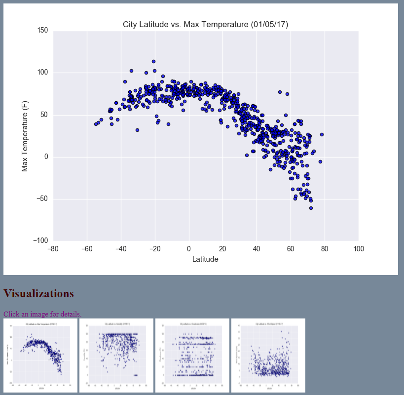

# Web-Design-Challenge

This challenge is to display knowledge on basic web creation by using HTML, CSS, and Bootstrap.

This is to show the relationship using data containing city latitude and comparing it to: humidity, cloudiness, and wind speed.
The purpose of the project was to analyze the change in weather as the data gets closer to the equator. The data was extracted from the OpenWeatherMap API
and a dataset of over 500 cities was created. Using the dataset, MatPlotLib was used to plot city latitude versus multiple weather aspects such as: temperature, humidity, cloudiness, and wind speed. This site provides insight on the data by using the source data visualizations that were created along with an explanation/description of the correlation and trend seen. Below is brief view of the site.

